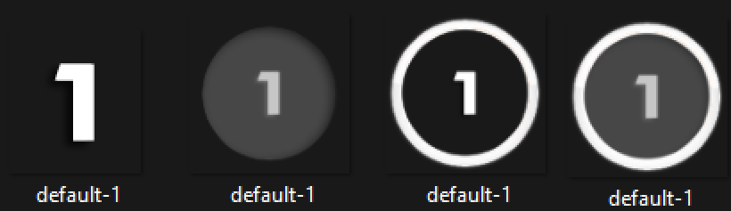

Updates Found in releases

Picture:
   1. Default not edits
   2. Triplestack with skins original files only
   3. Triplestack with rafis only
   4. Triple stack with original skins hitoverlay and rafis
         -Note, this looks awful in game, really for fl skins.
      
NO MOD SKINS, (with background to avoid picture 4)
JUST USE RAFIS ADDON
   

If you find bugs please let me know.
If your skin's hitcircle is a faint background (not a circle) common in no mod skins, I'd reccomend using the option that includes both rafis and the provided one.
If you're skin is saying it is missing the default-#, they may be found in the skins folder called "assests" or simliar, please drag and drop it into the skins  folder for now
   - (Need to update another statement for that but I'm lazy)

How to use

1. Options
   - Click "Options" to expand settings.
   - **Copy & Process**: Creates a new skin folder for output (recommended).
   - **Force Overlay Res**: Set the output image size (default 160).
   - **Offset Factor**: Adjusts the stacking offset.
   - **Use Only Rafis hitcircle**: Uses only the provided hitcircle.png (ignores your skin's hitcircle).
   - **Use existing hitcircle + Rafis circle**: Combines your skin's hitcircle with the provided one (Rafis).

2. **Preview**
   - The canvas shows a live preview of the stacking result.
   - The Numbered should be larger than the others!

3. Export
   - Click "Confirm" to process and export the new skin.
   - The app will create a new skin folder (if "Copy & Process" is enabled) and update the images.

Notes
- Your original skin folder is never modified. (at least it should not be)
- Back up your skins before use!

Troubleshooting
- If you see errors about missing files, check that your skin folder and `hitcircle.png` are present.

Enjoy playing you disguisting farmer.
